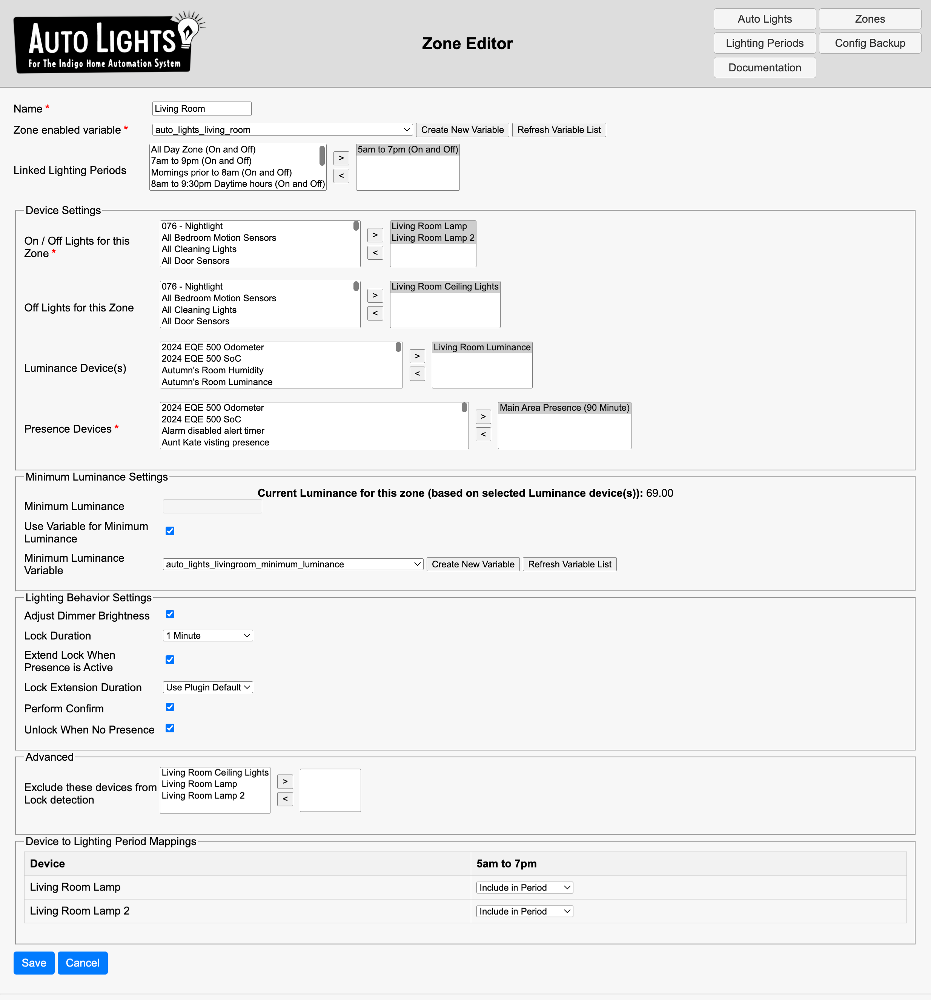
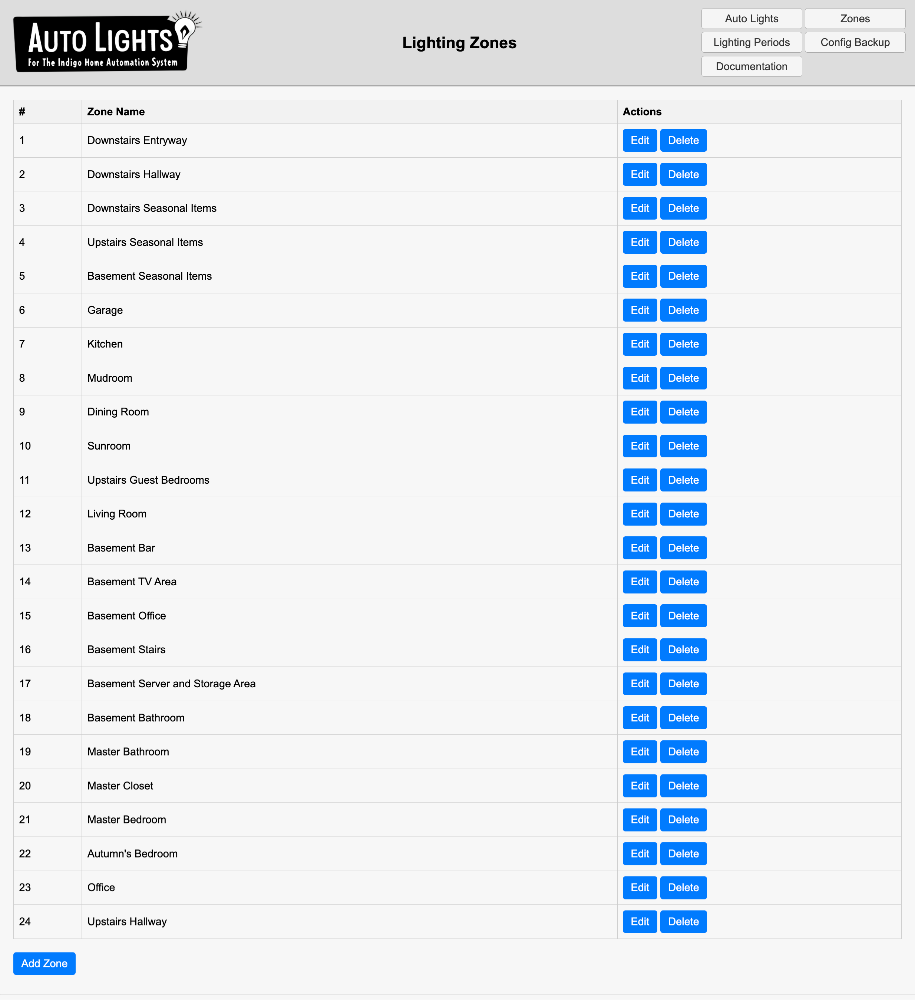

Auto Lights is a lighting automation plugin for the Indigo Home Automation system.

---

## Features at a Glance

Auto Lights is an **opinionated** lighting behavior template for your home. It enables you to set up Lighting Zones (
this is intentionally vague, you can define a Zone to be whatever you want), and configure behavior for each Zone that
standardizes the way Indigo controls lights in your home.

I originally built Auto Lights for my own use in a sensor-rich home, where nearly every room is managed by Auto Lights.
However, Auto Lights can be used in less complex homes as well. The idea is to save you from configuring many many
Indigo Triggers and Variables to achieve a basic level of automatic light control functionality to do things like:

- **Multi-Zone Management**: Create and manage multiple “Zones” in Indigo from a single interface.
- **Presence-Based Lighting**: Use one or more presence sensors or timers and only turn on lights when someone is
  around.
- **Luminance-Aware**: Luminance device(s) can be defined, with a minimum luminance setting. This enabled the plugin to
  determine if the room
  is dark, or not, thus making the logic: If Presence while Dark and Period is set to Auto Lights Control -> Turn on the
  lights.
- **Zone Locking Mechanism**: Temporarily lock a Zone whenever a user manually overrides the lights, so the plugin won’t
  revert your change until the lock expires or is reset.
- **Automatic Dimming**: Auto Lights can optionally set the brightness to a % based on the current luminance level of
  the
  room. For example: target brightness = (1 - (Current Luminance / Minimum Luminance)) * 100.
- **Global Enable/Disable**: A single variable can switch off the entire Auto Lights system. Helpful for scenarios like
  turning off lights when you go to bed, or are not at home.

---

## Requirements

1. **Indigo Version**  
   Auto Lights is tested with the latest Indigo. Older versions may or may not be fully compatible.

2. **API Key / Reflector**  
   To use the Auto Lights web editor, you’ll need to enable remote access or an Indigo reflector with API
   Key. [The Web Config](The%20Web%20Config%20Editor).

3. **Presence & Luminance Devices**  
   Almost any Indigo-compatible motion sensor, threshold timer, or other presence device can tell Auto Lights when a
   room is occupied. Luminance sensors give you the brightness-based dimming logic.

---

## The Web Config Editor

Auto Lights uses a web interface to build and configure your Zones. This path was chosen because the interface needed is
too advanced for the Indigo native ConfigUI.

The Web Config is run as a separate web server on your Indigo Server. Because of this, it must interact with your Indigo
via API, and I've only implemented support for using the API key. API keys are only enabled for Indigo with support for
the reflector. I recommend creating a unique API key for Auto
Lights [here](https://www.indigodomo.com/account/authorizations).

There is no authorization on the Web Config interface itself. If this concerns you, there are two options available:

* Set your web server to only bind to localhost, this will make it so that the web config is only available on your
  Indigo host directly, and not to addresses on your LAN.
* Disable the web config server once you've configured your Auto Lights. The plugin does not need it for execution, it's
  only needed to build your config.

## Documentation

See documentation [here](Auto%20Lights.indigoPlugin/Contents/Server%20Plugin/config_web_editor/static/Documentation.MD)

---

## Plugin Configuration

Access these settings via **Plugins > Auto Lights > Configure…** in Indigo:

1. **Reflector / Indigo API URL**  
   The base URL used by Auto Lights for Indigo API calls. Default is the Indigo Reflector service, but you can point to
   a local IP or hostname if you prefer.

2. **API Key**  
   Needed to authenticate API calls. If you’ve enabled “Remote Access” or an Indigo Reflector, you can create new API
   keys in your Indigo account.

3. **Disable Web Server**  
   Toggle this to fully turn off the built-in config web server. Use it if you want a fully “headless” experience after
   setting everything up.

4. **Web Config Bind IP**  
   `127.0.0.1` (only accessible locally) or `0.0.0.0` (accessible by devices on your local network).

5. **Web Config Bind Port**  
   Default is `9000`. Change it if something else is using that port.

6. **Logging Level**
    - 5 (Extra Debugging)
    - 10 (Debug)
    - 20 (Info)
    - 30 (Warning)
    - 40 (Error)
    - 50 (Critical)

Choose a level based on how much detail you need in your Indigo logs.

---

## Plugin Options / Menu Items / Actions

Auto Lights Actions:

1. **Reset All Zone Locks**  
   Clears lock timers on all Zones, letting Auto Lights resume control immediately.

2. **Reset Specific Zone Lock**  
   Enables you to unlock just one Zone if you had a manual override but now want automation to resume.

Additionally, available under **Plugins > Auto Lights**:

1. **Print All Locked Zones**  
   Logs each locked Zone, showing when the lock will expire.

## Screenshots

### Zone Editor



### Lighting Zones



```
