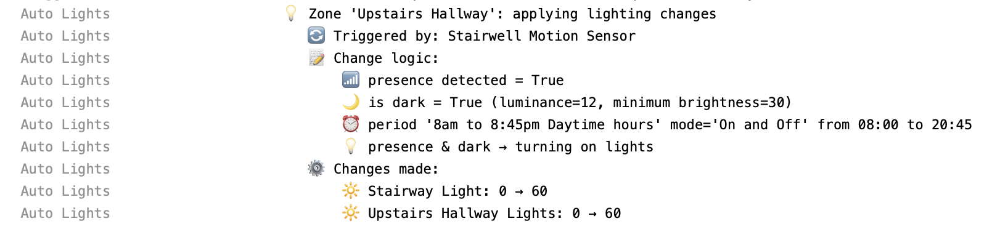

Auto Lights is a lighting automation plugin for the Indigo Home Automation system.

---

## Features at a Glance

Auto Lights is an **opinionated** lighting behavior template for your home. It enables you to set up Lighting Zones (
this is intentionally vague, you can define a Zone to be whatever you want), and configure behavior for each Zone that
standardizes the way Indigo controls lights in your home.

I originally built Auto Lights for my own use in a sensor-rich home, where nearly every room is managed by Auto Lights.
However, Auto Lights can be used in less complex homes as well. The idea is to save you from configuring many many
Indigo Triggers and Variables to achieve a sophisticated level of automatic light control functionality to do things
like:

- **Multi-Zone Management**: Create and manage multiple “Zones” in Indigo from a single interface.
- **Presence-Based Lighting**: Use one or more presence sensors or timers and only turn on lights when someone is
  around.
- **Luminance-Aware**: Luminance device(s) can be defined, with a minimum luminance setting. This enabled the plugin to
  determine if the room
  is dark, or not, thus making the logic: If Presence while Dark and Period is set to Auto Lights Control -> Turn on the
  lights.
- **Zone Locking Mechanism**: Temporarily lock a Zone whenever a user manually overrides the lights, so the plugin won’t
  revert your change until the lock expires or is reset.
- **Automatic Dimming**: Auto Lights can optionally set the brightness to a % based on the current luminance level of
  the
  room. For example: target brightness = [1 - (current luminance / minimum luminance)] x 100.
- **Global Enable/Disable**: A single variable can switch off the entire Auto Lights system. Helpful for scenarios like
  turning off lights when you go to bed, or are not at home.
- **Clear Explainability**: Auto Lights tries to be transparent in why changes are being made (or not made) so that you
  can focus on tweaking your configuration to your needs.

Example output:


---

## Requirements

1. **Indigo Version**
   Auto Lights is tested with the latest Indigo. Older versions may or may not be fully compatible.

2. **Lights to Control & Presence Devices**
   Almost any Indigo-compatible lighting device, plus some way of reporting presence to determine if a zone is occupied,
   such as a motion sensor or virtual presence device. Luminance sensors are optional, and give you the brightness-based
   dimming logic.

---

## The Web Config Editor

Auto Lights uses a web interface to build and configure your Zones. This path was chosen because the interface needed is
too advanced for the Indigo native ConfigUI. See [here](#screenshots) for screenshots.

The web configuration interface is integrated with Indigo's built-in Web Server (IWS):

- **No separate web server configuration needed** - no need to configure bind IPs, ports, or API keys
- **Integrated authentication** - uses the same Indigo credentials as your Indigo web interface
- **Simple access** - available through Indigo's standard web server on port 8176

### Accessing the Web Configuration

There are two ways to access the web configuration interface:

1. **Via Indigo Menu** (easiest):
   - Go to **Plugins > Auto Lights > Open Web Configuration**
   - This will open the web interface in your default browser

2. **Direct URL**:
   - On the Indigo server: `http://localhost:8176/message/com.vtmikel.autolights/web_ui/`
   - From another computer on your network: `http://<indigo-server-ip>:8176/message/com.vtmikel.autolights/web_ui/`
   - You'll be prompted for your Indigo username and password

## Documentation

See documentation [here](Auto%20Lights.indigoPlugin/Contents/Resources/static/Documentation.MD)

---

## Plugin Configuration

Access these settings via **Plugins > Auto Lights > Configure…** in Indigo:

1. **Event Logging Level**
   - 5 (Extra Debugging Messages)
   - 10 (Debugging Messages)
   - 20 (Informational Messages) - Default
   - 30 (Warning Messages)
   - 40 (Error Messages)
   - 50 (Critical Errors Only)

   Choose a level based on how much detail you need in your Indigo logs.

2. **Log non-action-taken events to the Indigo Event Log**
   When enabled, the plugin will log extra information about why actions were not taken (e.g., "Zone locked", "Luminance too high").
   Not recommended unless you are debugging your configuration.

---

## Plugin Options / Menu Items / Actions

Auto Lights Actions:

1. **Reset All Zone Locks**
   Clears lock timers on all Zones, letting Auto Lights resume control immediately.

2. **Reset Specific Zone Lock**
   Enables you to unlock just one Zone if you had a manual override but now want automation to resume.

Additionally, available under **Plugins > Auto Lights**:

1. **Open Web Configuration**
   Opens the web interface for configuring zones in your default browser. See [The Web Config Editor](#the-web-config-editor) for more details.

2. **Print All Locked Zones**
   Logs each locked Zone, showing when the lock will expire.

## Screenshots

### Zone Editor


### Lighting Zones


```
